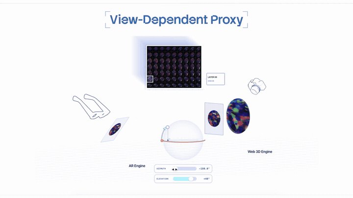

# View-dependent proxy

An interactive 3D object proxy whose appearance is selected from a view-dependent image atlas.

[Open the live interactive demo](https://armandsumo.com/labs/view-dependent-proxy/)

[](https://armandsumo.com/labs/view-dependent-proxy/)

[Watch the full-quality showcase video](https://armandsumo.com/assets/view-dependent-proxy/VDP-demo.mp4)

## What it does

An object with costly view-dependent optical behavior is rendered offline from a set of sampled camera positions. Those images are packed into a multi-view atlas. At runtime, the browser chooses the atlas cell nearest the viewer's azimuth and elevation, then places that image on an object-aligned proxy. A lightweight mesh supplies spatial placement, interaction, and occlusion cues.

This avoids executing the source renderer live. A path-traced render approximately scales with pixel count, samples per pixel, light bounces, and scene-intersection work. The expensive radiance sampling is completed once during the bake. Runtime work is atlas selection and rasterization.

This implementation is a form of **view-dependent image-based rendering**. The atlas is a multi-view impostor layer; the complete interactive assembly is a view-dependent proxy.

## Run locally

```sh
npm install
npm run dev
```

## Controls

- Drag the glasses to change the selected observer view.
- Drag the coordinate sphere or use the azimuth and elevation sliders.
- Drag the source proxy to rotate it.
- Right-drag or scroll to inspect the complete assembly.

## Assets and license

The code is MIT licensed. The included opal atlas, models, and showcase video are demonstration assets created for this repository. Replace the files in `assets/` with your own source mesh and offline-rendered atlas to adapt the proxy to another object.
